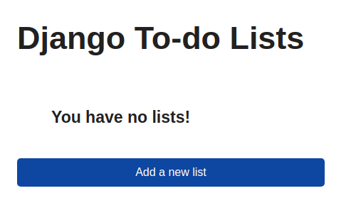
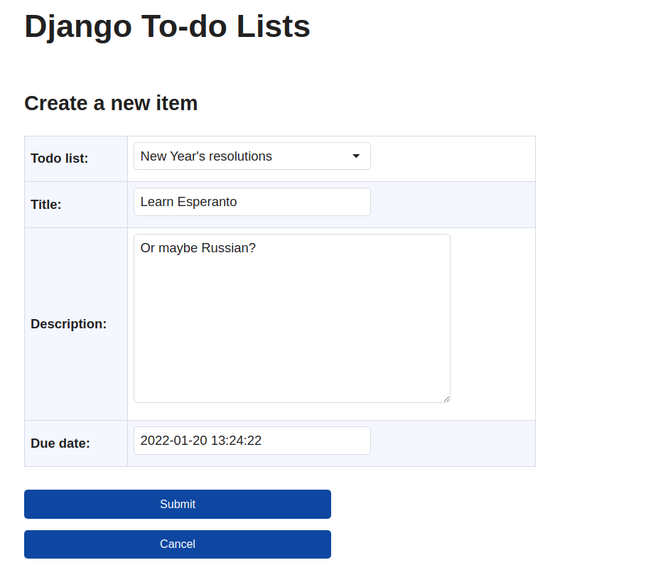
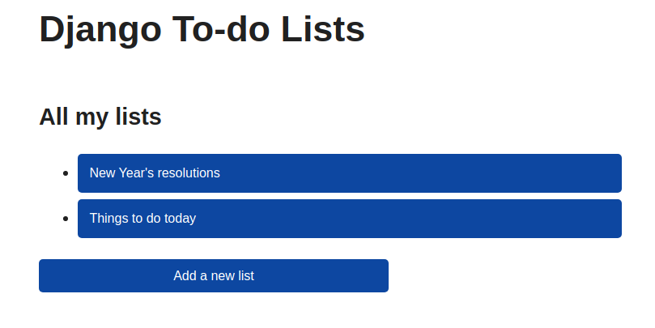
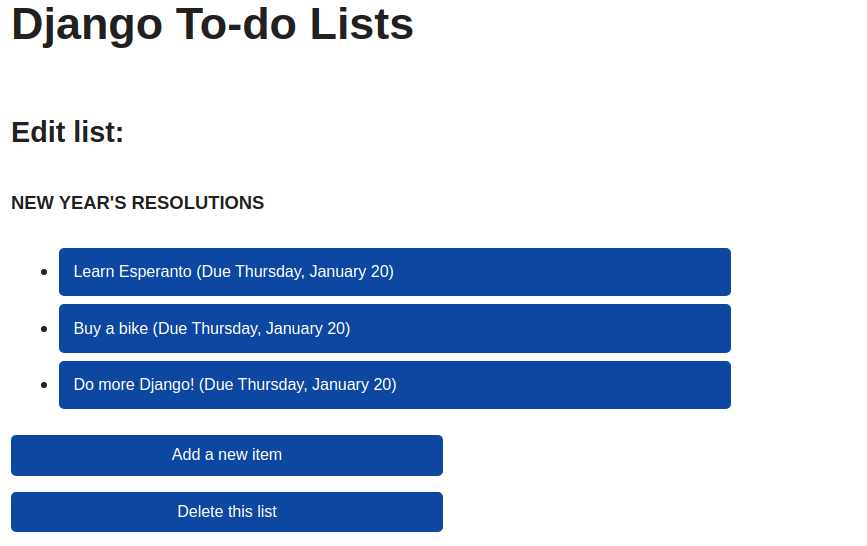

## Project Overview

The Django To-Do List application is a web-based platform designed to help users manage their tasks efficiently. Users can create multiple to-do lists, add items to each list, update item details, and delete items as needed. This application utilizes Django's powerful framework to handle backend operations, making it easy to develop and maintain. The interface is user-friendly, allowing for seamless navigation between lists and tasks. The app supports various functionalities such as setting due dates for tasks and modifying list titles, ensuring users can customize their experience to fit their needs. The project serves as a practical example of using Django to develop a functional web application, showcasing key concepts such as CRUD operations, URL routing, and form handling.

### Table of Contents

1. [Project Overview](#project-overview)  
2. [Prerequisites](#prerequisites)  
3. [Introduction](#introduction)   
   3.1. [Installation](#how-to-download-and-run-the-project)  
   3.2. [Running the Django To-Do List App](#running-the-django-to-do-list-app)  
   3.3. [Using the Application](#using-the-application)  
   3.4. [Project Structure](#project-structure)  

4. [How to Write Your Own To-Do List](#how-to-write-your-own-todo-list-django-app)  
   4.1. [Step 1: Django Project Setup](#step-1-django-project-setup)  
   4.2. [Step 2: Configure App](#step-2-configure-app)  
   4.3. [Step 3: Set Up Data Models](#step-3-set-up-data-models)  
   4.4. [Step 4: Create a To-Do List and Sample To-Do Item](#step-4-create-a-to-do-list-and-sample-to-do-item)  
   4.5. [Step 5: Create Django Views](#step-5-create-django-views)  
   4.6. [Step 6: Create and Update Model Objects in Django](#step-6-create-and-update-model-objects-in-django)  
   4.7. [Step 7: Delete To-Do Lists and Items](#step-7-delete-to-do-lists-and-items)  

5. [Testing Your Application](#testing-your-application-1)  
6. [Conclusion](#conclusion)  


## Prerequisites

Before you begin, ensure you have the following software installed on your system:

- **Python**: Version 3.6 or higher.
- **Django**: Version 3.0 or higher. You can install it using pip:
  ```bash
  pip install django
  ```
- **Git**: A version control system to manage your project’s code. You can download it from [git-scm.com](https://git-scm.com/).
- **GitHub**: A platform for hosting and collaborating on Git repositories. You can sign up for an account at [github.com](https://github.com/).
- **A code editor**: Any code editor of your choice (e.g., Visual Studio Code, PyCharm, or Sublime Text) for writing and editing code.

Make sure you have these prerequisites set up before moving on to the installation and setup of the Django To-Do List application.

## Introduction


### How to Download and Run the Project

To download and set up the project on your local development environment, follow these steps:

1. **Clone the Repository**:
   - Open a terminal and run the following command to clone the project from GitHub:
     ```
     git clone https://github.com/yourusername/todo_list.git
     ```
     Replace `yourusername` with your actual GitHub username and ensure the repository URL is correct.

2. **Navigate to the Project Directory**:
   - After cloning, navigate to the project's root directory:
     ```
     cd todo_list
     ```

3. **Set Up the Virtual Environment**:
   - If the `venv` folder is not included, you will need to create a virtual environment to manage dependencies:
     ```
     python -m venv venv
     ```

4. **Activate the Virtual Environment**:
   - On Windows:
     ```
     venv\Scripts\activate
     ```
   - On macOS/Linux:
     ```
     source venv/bin/activate
     ```

5. **Install Project Dependencies**:
   - With the virtual environment activated, install the required packages using `pip`:
     ```
     pip install -r requirements.txt
     ```

6. **Apply Migrations**:
   - To set up the database, apply migrations:
     ```
     python manage.py migrate
     ```

7. **Create a Superuser (Optional)**:
   - If you want access to the admin interface, create a superuser:
     ```
     python manage.py createsuperuser
     ```

8. **Run the Development Server**:
   - Start the Django development server:
     ```
     python manage.py runserver
     ```

9. **Access the Application**:
   - Open your web browser and navigate to `http://127.0.0.1:8000/` to interact with the To-Do List application.

These steps will allow you to download, set up, and run the project on your local development environment for testing or further development.

### Running the Django To-Do List App

To run the application, execute the following command:

```bash
python manage.py runserver
```

If everything is set up correctly, you'll be greeted by the home page of your Django To-Do List application. The heading "Django To-do Lists" will appear on every page, serving as a link back to the home page, making navigation easy.

### Using the Application

1. **Adding a New List**:
   - Click on **Add a new list** to create a new to-do list.
   - You'll be taken to a form where you can enter the list's title.
   - After saving, you'll be directed to the Edit List page, which will display a message if there are no to-do items in the list.

2. **Adding Items to a List**:
   - Click on **Add a new item** to create a new to-do item.
   - Fill out the form with a title, description, and due date (defaulting to one week ahead, though you can modify it).

3. **Navigating the App**:
   - Return to the home page at any time by clicking the "Django To-do Lists" heading.
   - From the home page, you can add more lists, add items to existing lists, modify item details, or delete lists and items.

Images of the application in action:

- **Home Page**: This is the starting point of the application where you can view, add, and manage your to-do lists.

  

- **Create Item Form**: This form allows you to add a new item to a to-do list, with all the relevant fields like title, description, and due date.

  

- **Home Page with Lists**: Here's an example of what your home page might look like after adding some lists.

  

- **List Details**: This view shows the details of a specific to-do list, including its items.

  

By following these steps and features, you can fully test and use the Django To-Do List app.


### Project Structure
This To-Do List project is structured as follows:

```
TODO_LIST/
│
├── img/
│   ├── create_item_form.png
│   ├── homepage_list.png
│   ├── homepage.png
│   └── list.png
│
├── todo_app/
│   ├── migrations/
│   ├── templates/
│   ├── __init__.py
│   ├── admin.py
│   ├── apps.py
│   ├── models.py
│   ├── tests.py
│   ├── urls.py
│   └── views.py
│
├── todo_project/
│   ├── __init__.py
│   ├── asgi.py
│   ├── settings.py
│   ├── urls.py
│   └── wsgi.py
│
├── venv/
│
├── db.sqlite3
├── main.py
├── manage.py
├── README.md
└── requirements.txt
```

This structure organizes the code into a modular format, with separate components for templates, views, models, and the core project settings. Images used for UI display are located in the `img/` folder for easy reference. The virtual environment (`venv/`) ensures package management is isolated for this project.

## How to write your own todo list django app

### Step 1: Django Project Setup

1. **Initialize GitHub Repository**:
   - Create a new GitHub repository for your project.

2. **Set Up Virtual Environment**:
   - Create a virtual environment.
     ```bash
     python -m venv venv
     ```

3. **Activate Virtual Environment**:
   - On Windows:
     ```bash
     venv\Scripts\activate
     ```
   - On macOS/Linux:
     ```bash
     source venv/bin/activate
     ```

4. **Install Django**:
   ```bash
   pip install django
   ```

5. **Update and Pin Dependencies**:
   - Create a `requirements.txt` file and pin the versions of your dependencies.
   ```bash
   pip freeze > requirements.txt
   ```

6. **Set Up Django Architecture**:
   Create the following directory structure:

   ```
   todo_list/
   │
   ├── todo_app/
   ├── todo_project/
   │   ├── __init__.py
   │   ├── asgi.py
   │   ├── settings.py
   │   ├── urls.py
   │   └── wsgi.py
   │
   ├── venv/
   │
   ├── manage.py
   └── requirements.txt
   ```

### Step 2: Configure App

1. **Create URL Paths**:
   - In `urls.py`, set up URL patterns for your application.

2. **Run Development Server**:
   ```bash
   python manage.py runserver
   ```

### Step 3: Set Up Data Models

1. **Define Data Models in `models.py`**:
   - Import necessary modules.
   - Create the `ToDoList` and `ToDoItem` models.
   - Define fields and methods as explained in your comments.

2. **Create Database**:
   - Generate migration files and apply them:
   ```bash
   python manage.py makemigrations todo_app
   python manage.py migrate
   ```

### Step 4: Create a To-Do List and Sample To-Do Item

1. **Create Superuser**:
   ```bash
   python manage.py createsuperuser
   ```

2. **Register Models in `admin.py`**:
   - Import the models and register them.

3. **Access Admin Interface**:
   - Run the server and navigate to `http://127.0.0.1:8000/admin/`.

4. **Access the Admin Interface**:
   - On the left side of the main Django administration page, click on **To do lists**.

5. **Add a New To-Do List**:
   - On the next screen, click the button at the top right that says **ADD TO DO LIST**.
   - In the form that appears, enter a title for your list (e.g., **Things to do today**).
   - Click the **SAVE** button on the extreme right of the screen. 
   - The new list will now appear on a page headed **Select to do list to change**.

6. **Add a Sample To-Do Item**:
   - Instead of selecting the newly created list, click on the **+ Add** button next to **To do items** on the left of the screen.
   - A new form will appear for adding a To-Do item.
   - Fill in the form with the following sample data:
     - **Title**: Start my to-do list
     - **Description**: First things first.
     - **Due Date**: Leave this as it is (it will default to one week from today).
     - **To-Do List**: Select your newly created to-do list title from the dropdown menu.
   - Click the **SAVE** button to save the item.

7. **Explore the Admin Interface**:
   - You have now created one list and one item using the admin interface.
   - Feel free to explore the pages to get a feel for how they work. The admin interface is a useful tool for quickly managing data as a developer but is not intended for regular user access.


### Step 5: Create Django Views

1. **Open the `views.py` File**:
   - Navigate to the `todo_list/todo_app` directory and open the `views.py` file.

2. **Add the ListView**:
   - Create a `ListView` class to display To-Do Lists in your `views.py`. This view will help retrieve and present the lists to users.

3. **Create a Templates Folder**:
   - Inside the `todo_app/` directory, create a new folder named `templates/`. This folder will be used to store all the HTML templates for your Django application.

4. **Create the Base Template**:
   - Within the `templates/` folder, create a file named `base.html`. This file will serve as the foundation for your application's HTML structure and styling.
   - Structure your `base.html` file with the necessary HTML declarations, `<head>` section for meta tags and stylesheets, and a `<body>` section that includes a header and a content block. This template will provide a consistent layout for all pages in your application through template inheritance.

5. **Add the Home Page Template**:
   - To follow Django's convention, create a new folder named `todo_app` inside the `templates/` directory. The structure should be `todo_app/templates/todo_app/`.
   - Within this newly created folder, add a file named `index.html`. This page will display a list of all your To-Do Lists, or an informative message if none exist. Each title will be a clickable link directing users to the corresponding list page.

6. **Build Request Handlers**:
   - Update the `urls.py` file in your app to add a route for the home page, allowing users to access the To-Do Lists through the defined URL.

7. **Create ItemListView**:
   - Define an `ItemListView` class in `views.py` to display items associated with a specific To-Do List. This view will retrieve the To-Do items for the selected list.

8. **Create the `todo_list.html` Template**:
   - Create a template named `todo_list.html` to display the To-Do items in a given list. Use the appropriate Django template tags to iterate over the items and display their details.


### Step 6: Create and Update Model Objects in Django

In this step, we will focus on adding new views that support **Create** and **Update** actions for the To-Do application. Afterward, URLs will be added to reference these views, and the `todo_items.html` template will be updated to allow users to navigate to these new URLs for creating and updating items in their to-do list.

#### Update Views for Create and Update Actions

1. **Open the `views.py` File**:
   - Navigate to the `todo_list/todo_app` directory and open the `views.py` file where you will add the code for the new views.

2. **Create `ListCreate` View**:
   - Define a view to create a new To-Do List. This view will contain a form with a single field for the title of the list, enhancing the user experience by guiding them through the process of creating a new list.

3. **Create `ItemCreate` View**:
   - Define a view for creating To-Do Items with pre-populated data. This view will generate a form with four fields: the to-do list the item belongs to, the title of the item, a description, and a due date. You will override several methods to enhance the functionality of the form, such as pre-populating the to-do list based on the list ID passed in the URL.

4. **Create `ItemUpdate` View**:
   - Define a view for updating existing To-Do Items. This view will be similar to `ItemCreate`, but it will provide a title like "Edit item" to indicate to users that they are updating an existing item. It will also include the same fields and context behavior, just tailored for updates.

#### Add Routes to `urls.py`

To enable the creation and update of to-do lists and items, you'll need to define routes in `urls.py` that allow users to access the new views:

- The "list-add" route will allow users to add a new to-do list. This route will point to the view responsible for creating new lists.
- The "item-add" route will enable users to add a new item to a specific To-Do List, taking a dynamic `list_id` parameter to ensure the new item is associated with the correct list.
- The "item-update" route will be for updating an existing item within a to-do list. This route will take two dynamic parameters: `list_id` to identify the to-do list and `pk` (primary key) to identify the specific item being updated.

By adding these routes, users will be able to navigate to the appropriate pages for creating and updating lists and items.

#### New Views and Templates

1. **Adding a Button to Create a New List**:
   - In `index.html`, add a button that links to the "list-add" URL pattern. When clicked, this button will instantiate the `ListCreate` view, allowing users to create a new list.

2. **Updating `todo_list.html`**:
   - Replace the existing `onclick` events with handlers that invoke the new URLs for updating and adding items. This includes the "item-update" URL for existing items and the "item-add" URL for new items.

3. **Creating Templates for Views**:
   - **todolist_form.html**: This template will handle the form for creating a new list. It should include a `<form>` element for the title and utilize `{{ form.as_p }}` to generate the form content, ensuring to include `` for security.
   - **todoitem_form.html**: Similar to `todolist_form.html`, but structured as a table to handle the creation or update of individual to-do items, utilizing `{{ form.as_table }}` for better layout.

#### Testing Your Application

Finally, run your development server to verify that you can create new to-do lists, add items to those lists, and update existing items. Ensure that the form submissions are processed correctly and that users are redirected appropriately after creating or updating their lists or items.

```bash
python manage.py runserver
```

### Step 7: Delete To-Do Lists and Items

In this step, you will implement the delete functionality for both To-Do Lists and To-Do Items by creating views that handle the deletion process and redirect users to the appropriate pages once the deletion is confirmed.

First, ensure that you import the necessary modules from `django.views.generic`, such as `DeleteView`, in your `views.py` file. Next, create two separate view classes:

1. **ListDelete** – Manages the deletion of an entire To-Do List. After a list is deleted, the user is redirected to the homepage or another relevant page.
2. **ItemDelete** – Handles the deletion of a single To-Do Item from a list. Once the item is deleted, the user is redirected back to the associated To-Do List to view the remaining items.

These views make it easier for users to remove lists or individual items, improving the application's functionality.

#### Steps for Deletion Functionality

1. **Create Deletion Templates**:
   - Create `todolist_confirm_delete.html` for confirming the deletion of a `ToDoList` object.
   - Create `todoitem_confirm_delete.html` for confirming the deletion of a `ToDoItem` object.
   - These templates should include a confirmation message and two buttons: one to confirm deletion and one to cancel the action.
   - If the user confirms deletion, the object is deleted, and Django redirects the user. For `ToDoList`, they are redirected to the home page, and for `ToDoItem`, they are redirected to the parent list page.

2. **Define Routes for Deletion**:
   - In `urls.py`, define the routes for deleting `ToDoList` and `ToDoItem` objects.
   - Ensure the appropriate URLs are mapped to the `DeleteView` subclasses responsible for managing the deletion process.

3. **Handle Cancel Actions**:
   - For `ToDoList` deletion, canceling redirects the user to the home page.
   - For `ToDoItem` deletion, canceling redirects the user to the parent list view.

These steps provide users with the option to delete to-do lists and items while confirming the action, adding a layer of usability and control.

#### Adding Deletion Buttons in the Interface

1. **Delete Button for To-Do Items**:
   - Modify `todoitem_form.html` to include a button that links to the item's deletion URL, allowing users to remove the item from the list.

2. **Delete Button for To-Do Lists**:
   - In `todolist.html`, add a button to allow users to delete an entire list. This button should link to the deletion URL for the list, enabling the removal of a list along with its items.

By adding these deletion options in the templates, you enhance the application's interactivity, ensuring that users can delete lists and items as needed.

#### Testing Your Application

Finally, run your development server to verify that you can create new to-do lists, add items to those lists, update existing items, and delete lists or items as needed. Ensure that the form submissions are processed correctly and that users are redirected appropriately after creating, updating, or deleting their lists or items.

```bash
python manage.py runserver
```

## Conclusion

This Django To-Do List application demonstrates a variety of features and concepts, including:

- Creating a web app using Django
- Structuring a data model with one-to-many relationships
- Exploring and managing data using the Django admin interface
- Displaying lists and items by coding custom templates
- Handling standard database operations (CRUD) through class-based views
- Configuring URLs to control the Django URL dispatcher and route requests to the correct views
- Applying modern object-oriented principles and inheritance for code reuse and improved maintainability


Create Custom CSS file
Add hover style for clickable links

### 1. Create a CSS File
1. Create a directory for your static files if you don't already have one. This is usually named `static` and can be located at the same level as your `templates` directory.
2. Inside the `static` directory, create a subdirectory for your app (e.g., `todo_app`), and then create a CSS file (e.g., `styles.css`). The structure should look like this:

```
todo_list/
├── todo_app/
│   ├── templates/
│   │   └── base.html
│   └── static/
│       └── todo_app/
│           └── styles.css
```

### 2. Add Styles to the CSS File
In your `styles.css`, add the hover styles for your clickable links:

```css
/* static/todo_app/styles.css */

/* Custom CSS for hover effect on links */
h1 {
    cursor: pointer; /* Change cursor to pointer for clickable element */
    transition: color 0.3s; /* Smooth color transition */
}

h1:hover {
    color: #555; /* Change this color to your preferred hover color */
    opacity: 0.7; /* Dim the text on hover */
}

a {
    transition: color 0.3s; /* Smooth color transition for links */
}

a:hover {
    color: #555; /* Change this color to your preferred hover color */
    opacity: 0.7; /* Dim the text on hover */
}

/* Custom CSS for hover effect on div elements acting as buttons */
div[role="button"] {
    cursor: pointer; /* Pointer to indicate it's clickable */
    transition: color 0.3s ease; /* Smooth color transition */
    
}

div[role="button"]:hover {
    color: #555; /* Change color on hover */
    opacity: 0.7; /* Dim the text slightly */
}
```

### 3. Link the CSS File in Your Base Template
Now, update your `base.html` file to link to the new CSS file:

```html
<!-- todo_list/todo_app/templates/base.html -->
<!-- Base template for Django To-do Lists application -->
<!doctype html>
<html lang="en">

<head>
    <!-- Required meta tags for character encoding and responsive design -->
    <meta charset="utf-8">
    <meta name="viewport" content="width=device-width, initial-scale=1">
    
    <!-- Link to Simple.css for basic styling -->
    <link rel="stylesheet" href="https://cdn.simplecss.org/simple.min.css">
    
    <!-- Link to your custom CSS file -->
    <link rel="stylesheet" href="">

    <title>Django To-do Lists</title> <!-- Title of the webpage -->
</head>

<body>
    <div>
        <!-- Main heading that redirects to the index page when clicked -->
        <h1 onclick="location.href=''">
            Django To-do Lists
        </h1>
    </div>
    <div>
        <!-- Placeholder for content specific to different pages -->
        
        This content will be replaced by different HTML code for each page.
        
    </div>
</body>

</html>
```

### 4. Ensure You Have Static Files Configuration
Make sure you have the static files configuration set up in your Django project. In your `settings.py`, you should have:

```python
# settings.py

import os

# ...

# Static files (CSS, JavaScript, Images)
STATIC_URL = '/static/'
STATICFILES_DIRS = [os.path.join(BASE_DIR, 'static')]  # Adjust BASE_DIR if necessary
```

### 5. Load the Static Template Tag
Before you can use the `` template tag, make sure to load it at the top of your `base.html`:

```html

```


### Summary
Now, your application will use the styles defined in `styles.css`, and the hover effects will apply as intended. Remember to run your server and check your app to see the changes in effect.